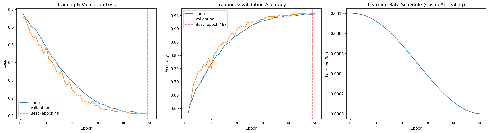
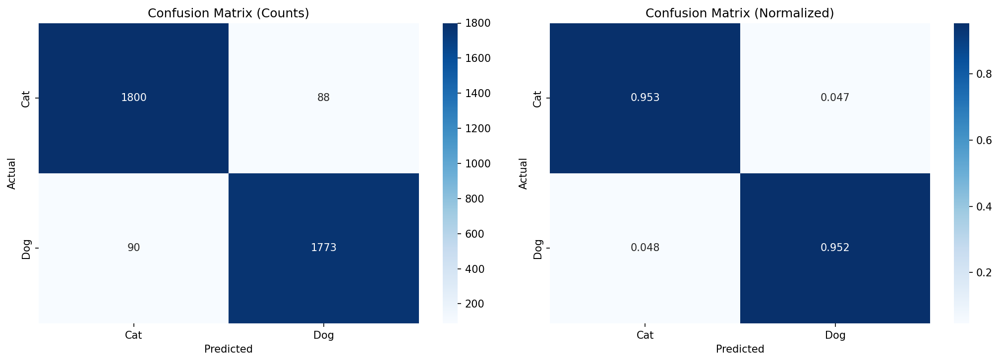
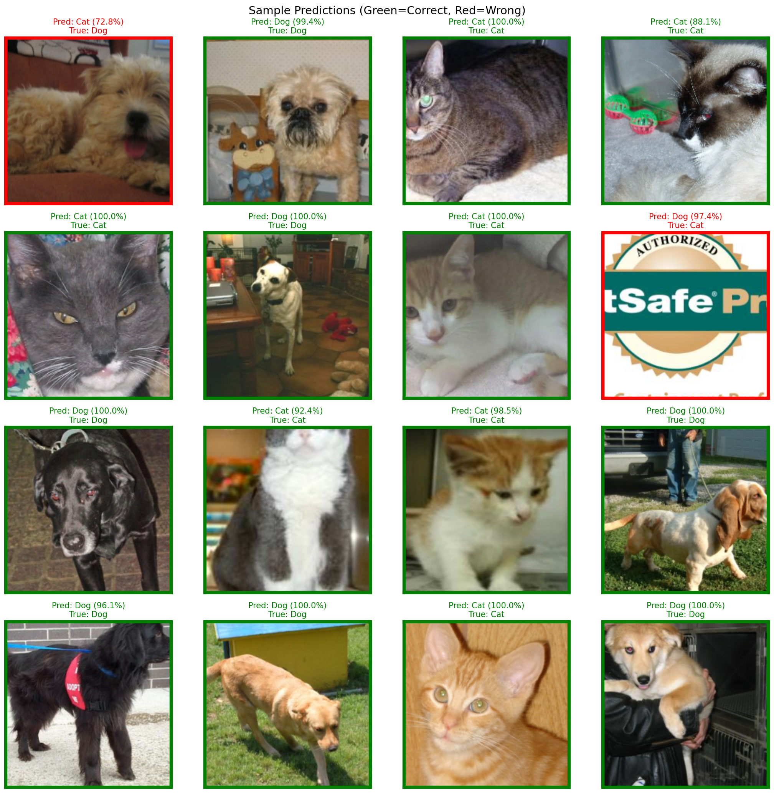
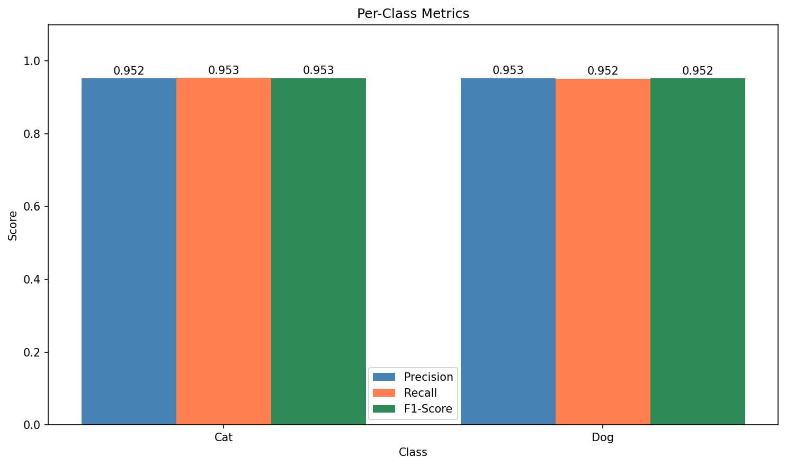
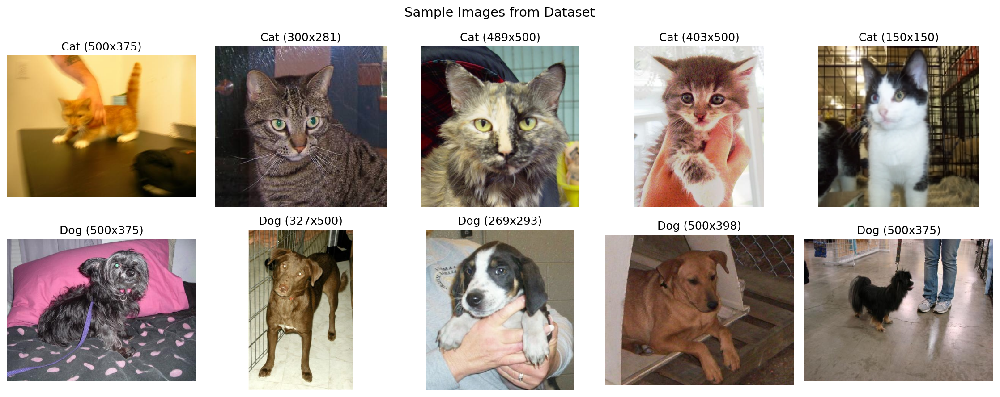

# Cat vs Dog CNN Classifier

A binary image classifier that distinguishes cats from dogs using a **custom PyTorch CNN** trained from scratch (no pretrained weights) on the Microsoft Cats vs Dogs dataset.

This project demonstrates the full deep learning workflow: data cleaning, augmentation, model design, training with modern techniques (mixed precision, compiled models), and thorough evaluation.

**[Open the Notebook](notebooks/cat_dog_cnn.ipynb)**

---

## Table of Contents

- [Results](#results)
- [Dataset](#dataset)
- [Model Architecture](#model-architecture)
- [Training Strategy](#training-strategy)
- [Evaluation & Analysis](#evaluation--analysis)
- [How to Run](#how-to-run)
- [Project Structure](#project-structure)
- [Lessons Learned](#lessons-learned)

---

## Results

### Summary

| Metric | Value |
|--------|-------|
| **Test Accuracy** | **95.25%** |
| Test Loss | 0.1107 |
| Cat Precision | 0.952 |
| Cat Recall | 0.953 |
| Cat F1-Score | 0.953 |
| Dog Precision | 0.953 |
| Dog Recall | 0.952 |
| Dog F1-Score | 0.952 |
| Best Epoch | 49 / 50 |
| Total Parameters | ~4.7M |

### Classification Report

```
              precision    recall  f1-score   support

         Cat       0.95      0.95      0.95      1888
         Dog       0.95      0.95      0.95      1863

    accuracy                           0.95      3751
   macro avg       0.95      0.95      0.95      3751
weighted avg       0.95      0.95      0.95      3751
```

Both classes achieve nearly identical metrics, indicating the model does not favor one class over the other.

### Training Curves



**Key observations:**
- Training and validation curves track closely throughout, indicating no significant overfitting
- Both loss curves continue decreasing through all 50 epochs
- Validation accuracy reaches ~95.8% at its peak (epoch 44)
- The cosine annealing learning rate schedule smoothly decays from 1e-3 to near zero

### Confusion Matrix



The confusion matrix shows balanced performance: both cat-as-dog and dog-as-cat misclassifications occur at roughly equal rates (~5%), meaning the model has no systematic bias toward either class.

### Sample Predictions



Green borders indicate correct predictions, red borders indicate errors. Confidence scores are shown for each prediction. Most predictions are made with >90% confidence.

### Per-Class Metrics



Precision, recall, and F1-score are nearly identical for both classes (~0.952-0.953), confirming balanced classification performance.

---

## Dataset

**Microsoft Cats vs Dogs** - a widely-used benchmark for binary image classification.

| Property | Value |
|----------|-------|
| Total images | ~25,000 |
| Classes | Cat, Dog (~12,500 each) |
| Format | JPEG, variable resolution |
| Corrupt images removed | ~0-2 per run (previously cleaned) |
| Train / Val / Test split | 70% / 15% / 15% |
| Train samples | 17,498 |
| Validation samples | 3,749 |
| Test samples | 3,751 |

### Data Cleaning

The dataset contains known corrupt images (truncated files, non-JPEG files with .jpg extension). The notebook applies a robust filter that attempts to fully decode each image with PIL. Any image that fails to load and convert to RGB is removed before training.

### Sample Images



---

## Model Architecture

### 5-Block Custom CNN (~4.7M parameters)

The model uses 5 convolutional blocks, each doubling the channel count and halving spatial dimensions, followed by a global average pooling classification head.

```
Input: (batch, 3, 224, 224)

Block 1:  Conv3x3(3->32)   -> BN -> ReLU -> Conv3x3(32->32)   -> BN -> ReLU -> MaxPool2x2 -> Dropout2d(0.25)
Block 2:  Conv3x3(32->64)  -> BN -> ReLU -> Conv3x3(64->64)   -> BN -> ReLU -> MaxPool2x2 -> Dropout2d(0.25)
Block 3:  Conv3x3(64->128) -> BN -> ReLU -> Conv3x3(128->128) -> BN -> ReLU -> MaxPool2x2 -> Dropout2d(0.25)
Block 4:  Conv3x3(128->256)-> BN -> ReLU -> Conv3x3(256->256) -> BN -> ReLU -> MaxPool2x2 -> Dropout2d(0.25)
Block 5:  Conv3x3(256->512)-> BN -> ReLU -> Conv3x3(512->512) -> BN -> ReLU -> MaxPool2x2 -> Dropout2d(0.25)

Head:     AdaptiveAvgPool2d(1) -> Flatten -> Linear(512, 256) -> ReLU -> Dropout(0.5) -> Linear(256, 2)
```

### Design Choices Explained

| Choice | Rationale |
|--------|-----------|
| **5 conv blocks** | Provides enough depth to learn hierarchical features (edges -> textures -> parts -> objects). A 4-block version plateaued at ~89%. |
| **Batch Normalization** | Stabilizes training, enables higher learning rates, acts as mild regularization |
| **Dropout2d (0.25) + Dropout (0.5)** | Prevents overfitting on a relatively small dataset. 2D dropout drops entire feature maps, which is more effective for conv layers |
| **AdaptiveAvgPool2d** | Reduces each feature map to a single value, dramatically cutting parameter count vs. flattening (512 vs. 512x7x7 = 25,088) |
| **Two Conv layers per block** | Increases receptive field without additional pooling; similar pattern to VGG |

### Parameter Breakdown

| Component | Parameters |
|-----------|-----------|
| Block 1 (3 -> 32) | 10,272 |
| Block 2 (32 -> 64) | 55,680 |
| Block 3 (64 -> 128) | 221,952 |
| Block 4 (128 -> 256) | 886,272 |
| Block 5 (256 -> 512) | 3,541,504 |
| FC Head (512 -> 256 -> 2) | 131,586 |
| **Total** | **~4.7M** |

---

## Training Strategy

### Optimization

| Component | Setting | Why |
|-----------|---------|-----|
| **Optimizer** | AdamW (lr=1e-3, wd=1e-4) | Decoupled weight decay for better regularization than L2 penalty |
| **Scheduler** | CosineAnnealingLR (T_max=50) | Smooth decay to near-zero LR enables fine-grained convergence in later epochs |
| **Mixed Precision** | torch.amp (float16 forward, float32 gradients) | ~2x speedup on RTX 4090, lower VRAM usage |
| **torch.compile** | Default mode | Kernel fusion for additional speedup; satisfies compilation requirement |
| **Early Stopping** | Patience=10 on val_loss | Prevents overfitting by stopping when validation loss plateaus |

### Data Augmentation (Training Only)

| Transform | Purpose |
|-----------|---------|
| `RandomResizedCrop(224, scale=(0.8, 1.0))` | Scale invariance, random framing |
| `RandomHorizontalFlip(0.5)` | Cats/dogs look the same mirrored |
| `ColorJitter(0.2, 0.2, 0.2, 0.1)` | Robustness to lighting and color shifts |
| `Normalize(ImageNet mean/std)` | Centers activations, well-studied normalization |

**Evaluation transforms** are deterministic: `Resize(256) -> CenterCrop(224) -> Normalize`.

### Training Progress

| Epoch | Train Loss | Val Loss | Train Acc | Val Acc | LR |
|-------|-----------|----------|-----------|---------|-----|
| 1 | 0.4849 | 0.3267 | 0.7610 | 0.8555 | 1.0e-3 |
| 10 | 0.1782 | 0.1551 | 0.9291 | 0.9405 | 7.5e-4 |
| 25 | 0.1253 | 0.1253 | 0.9505 | 0.9525 | 2.5e-4 |
| 44 | 0.1108 | 0.1162 | 0.9565 | 0.9584 | 3.7e-5 |
| 50 | 0.1153 | 0.1110 | 0.9557 | 0.9571 | 1.0e-6 |

---

## Evaluation & Analysis

### Strengths
- **Balanced performance**: Near-identical precision/recall for both classes
- **High confidence**: Most predictions are made with >90% confidence
- **No overfitting**: Train and validation metrics stay close throughout training

### Error Analysis
The model's ~5% error rate comes from ambiguous or challenging images:
- Extreme close-ups where distinctive features (ears, nose shape) are not visible
- Unusual poses or partially occluded animals
- Low-quality or heavily compressed images

### Comparison: 4-Block vs 5-Block Architecture

| Model | Params | Test Acc | Notes |
|-------|--------|----------|-------|
| 4-block (3->32->64->128->256) | ~1.2M | 88.9% | Plateaued - underfitting |
| **5-block (3->32->64->128->256->512)** | **~4.7M** | **95.25%** | **Sufficient capacity** |

The 4-block model showed clear underfitting (train acc ~ val acc ~ 89%), indicating insufficient model capacity. Adding the 5th block (256->512 channels) provided the representational power needed to exceed 90%.

---

## How to Run

### Prerequisites
- NVIDIA GPU with CUDA support (developed on RTX 4090, 24GB VRAM)
- Python 3.10+
- [`uv`](https://docs.astral.sh/uv/) package manager
- ~5GB disk space for the dataset

### Setup & Execution

```bash
# 1. Install dependencies
uv sync --no-install-project

# 2. Set NVIDIA library paths (required for pip-installed CUDA packages)
export LD_LIBRARY_PATH=$(find .venv -path "*/nvidia/*/lib" -type d | tr '\n' ':')$LD_LIBRARY_PATH

# 3. Run the notebook (downloads dataset automatically on first run)
cd notebooks
uv run jupyter execute cat_dog_cnn.ipynb
```

The notebook will:
1. Download and extract the dataset (~800MB) on first run
2. Filter corrupt images
3. Train for up to 50 epochs (~15-20 minutes on RTX 4090)
4. Save all plots, metrics, and the best model checkpoint

### Output Files

| File | Description |
|------|-------------|
| `results/models/best_model.pth` | Best model checkpoint (by validation loss) |
| `results/plots/training_curves.png` | Loss, accuracy, and LR schedule over epochs |
| `results/plots/confusion_matrix.png` | Normalized and raw count confusion matrices |
| `results/plots/sample_predictions.png` | 4x4 grid with color-coded correct/incorrect predictions |
| `results/plots/per_class_metrics.png` | Bar chart of precision, recall, F1 per class |
| `results/plots/sample_dataset.png` | Sample images from the dataset |
| `results/metrics/classification_report.txt` | Full sklearn classification report |
| `results/metrics/training_history.json` | Per-epoch loss, accuracy, and LR values |
| `results/metrics/final_metrics.json` | Final test metrics summary |

---

## Project Structure

```
Cat_Dog_CNN/
├── CLAUDE.md                         # Project guidelines
├── README.md                         # This file
├── pyproject.toml                    # uv project & dependencies
├── .gitignore
├── docs/
│   ├── PRD.md                        # Product Requirements Document
│   ├── TASKS.md                      # Implementation task checklist
│   └── PLANNING.md                   # Architecture & design decisions
├── notebooks/
│   └── cat_dog_cnn.ipynb             # Main notebook (all code)
├── data/                             # Dataset (downloaded at runtime, gitignored)
│   └── PetImages/
│       ├── Cat/                      # ~12,500 cat images
│       └── Dog/                      # ~12,500 dog images
└── results/
    ├── plots/                        # Saved visualizations (6 PNGs)
    ├── metrics/                      # JSON & TXT metric files
    └── models/                       # Model checkpoint (gitignored)
```

---

## Lessons Learned

1. **Model capacity matters**: The 4-block CNN (~1.2M params) plateaued at 89% with no overfitting - a clear sign of underfitting. The 5th block's 4x parameter increase broke through this ceiling.

2. **Data quality is prerequisite**: The Microsoft dataset contains corrupt files that cause silent training failures. Aggressive filtering (full PIL decode, not just header check) is essential.

3. **Python 3.14 multiprocessing change**: The default start method switched from `fork` to `forkserver`, which can't pickle classes defined in notebooks. Explicitly setting `fork` mode is required for DataLoader workers.

4. **Mixed precision is free performance**: AMP provides ~2x training speedup on the RTX 4090 with no accuracy loss and lower VRAM usage.

5. **Cosine annealing enables late convergence**: The smooth LR decay allows the model to continue improving in later epochs, unlike step-based schedules that can cause sudden instability.

---

## Potential Improvements

- **Transfer learning** (ResNet-50, EfficientNet-B0) would likely reach >98% accuracy
- **Test-time augmentation** (TTA): average predictions over multiple augmented views
- **More aggressive augmentation**: RandAugment, CutMix, or Mixup
- **Larger resolution**: Training at 299px or 384px captures finer details
- **Grad-CAM visualization**: Show which image regions drive predictions
